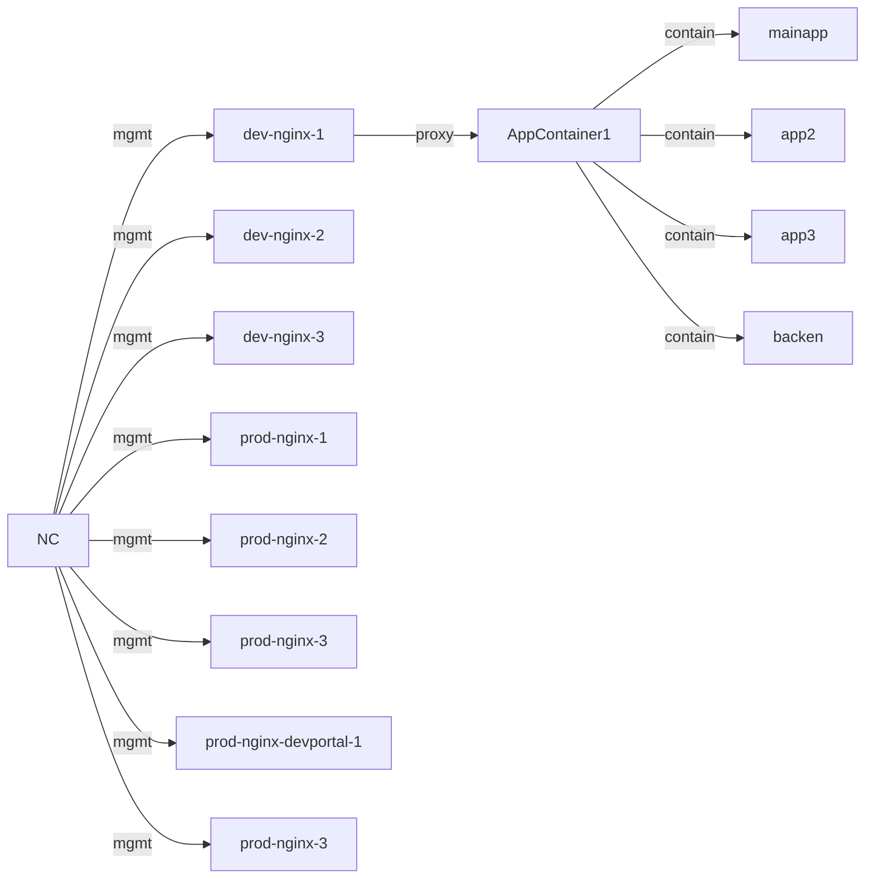
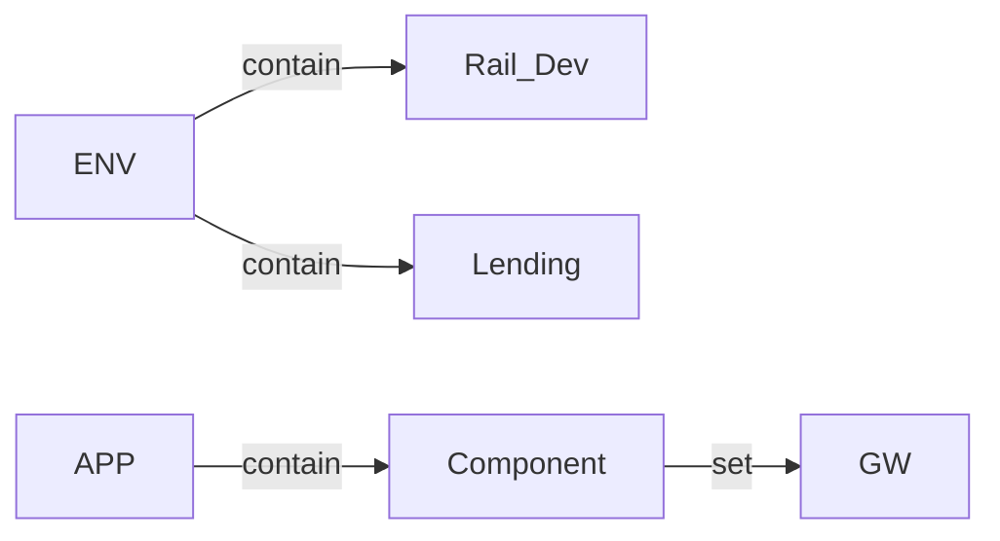

# NC Deployment Architecture And Deployment

## N+ instances mgmt by NC



## ENV config

## Prerequiste
```text
Need have Vagrant and virtual installed in local env before N+ and NC intallation.
```
## N+ Installation
N+ installation is ready once the VM running, since I've add the script to install N+ instances, and backend apps(mainapp, app2,app3, and backen)
## Controller Installation
1. Please Copy the Controller installation package into current directory, Since it's exceed the maximum size allowd by Github.
2. SSH into Controller VM
```shell
cd path_to_controller_vm && vagrant ssh
```
3. Disable selinux
```shell
sudo setenforce 0
sestatus
```
4. Install Controller
```shell
cd /vagrant/controller-installer
./install.sh
```
5. Follow the step by step to intall Controller

## NC GUI configuration - follow the UDF guide.
### ENV setup
### Certs setup
### GW setup
### App setup
